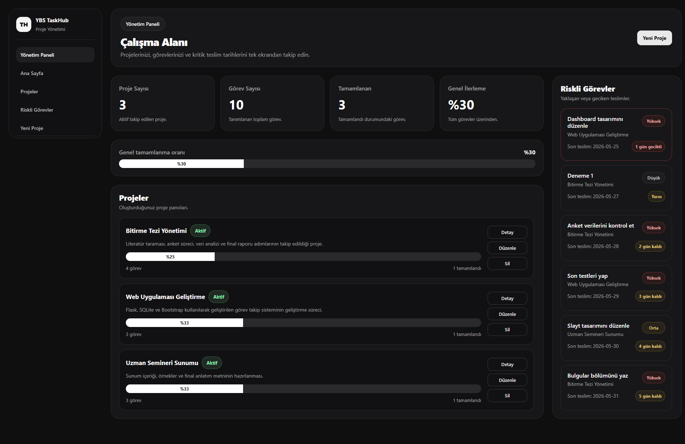

# 📋 YBS TaskHub

  

A modern web-based <strong>Project & Task Management System</strong> developed using <strong>Flask</strong>, <strong>SQLite</strong> and <strong>Bootstrap 5</strong>.

---

## 📖 Overview

**YBS TaskHub** is a modern project and task management application designed to help users organize projects, manage daily tasks and monitor project progress through an intuitive dashboard and Kanban board.

The application allows users to create projects, assign tasks, monitor deadlines, track completion progress and manage their workflow in a clean and responsive interface.
