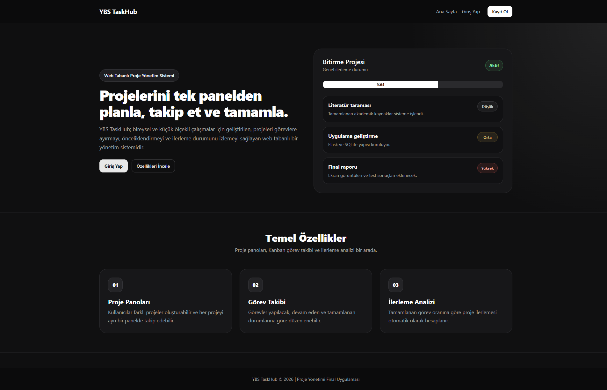
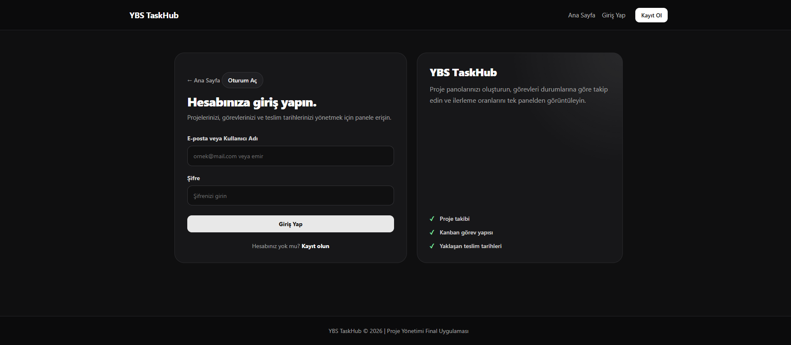
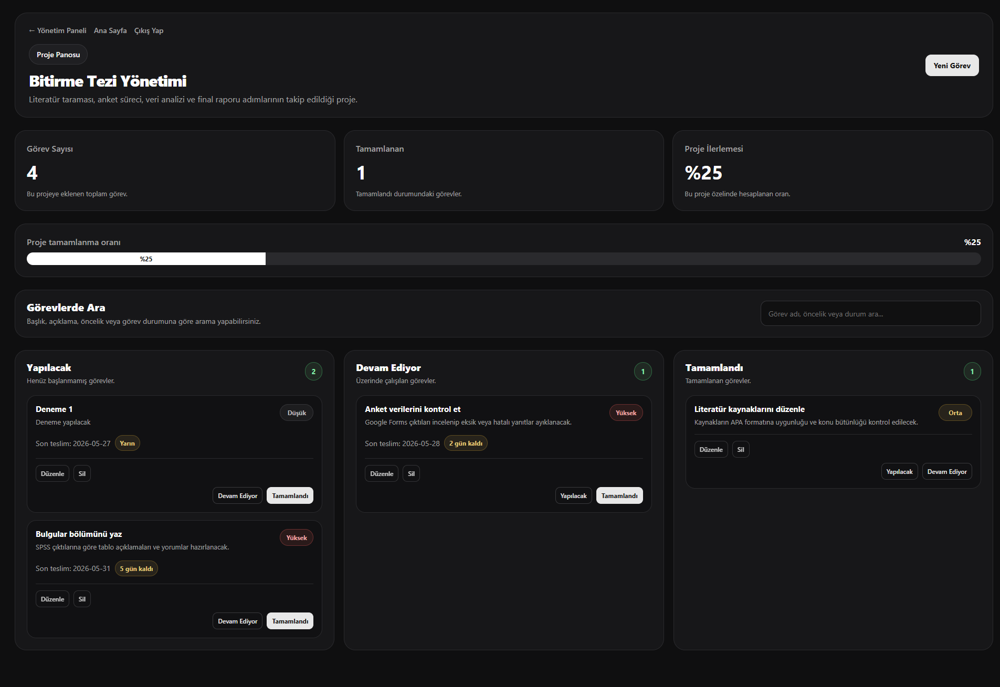

# 📋 YBS TaskHub - Project Management System

<p align="center">


</p>

<p align="center">
  
</p>

<p align="center">
A modern web-based <strong>Project Management System</strong> developed using <strong>Flask</strong>, <strong>SQLite</strong>, and <strong>Bootstrap 5</strong>. The application allows users to create projects, manage tasks, monitor project progress, and organize their workflow through a clean dashboard and Kanban board.
</p>

---

# 📖 Overview

YBS TaskHub is a project management application developed as a university Web Programming course project. It provides a simple and user-friendly environment where users can create projects, manage tasks, track progress, and monitor approaching deadlines.

The application follows a responsive design approach and focuses on usability with a modern interface.

---

# ✨ Features

- User registration and authentication
- Login using **username or e-mail**
- Create, edit and delete projects
- Create, edit and delete tasks
- Kanban board for task management
- Project progress calculation
- Dashboard statistics
- Risky task monitoring
- Task filtering by status
- Responsive user interface
- Automatic success notifications

---

# 🛠️ Technologies

| Technology | Purpose |
|------------|---------|
| Python | Backend |
| Flask | Web Framework |
| SQLite | Database |
| Bootstrap 5 | User Interface |
| HTML5 | Page Structure |
| CSS3 | Styling |
| JavaScript | Client-side Interactions |

---

# 📂 Project Structure

```text
YBS-TaskHub
│
├── assets/
├── static/
│   ├── css/
│   └── js/
│
├── templates/
│
├── app.py
├── database.py
├── models.sql
├── requirements.txt
├── seed_demo.py
├── README.md
└── LICENSE
```

---

# 🚀 Installation

Clone the repository

```bash
git clone https://github.com/emirCod/YBS-TaskHub.git
```

Navigate into the project folder

```bash
cd YBS-TaskHub
```

Install dependencies

```bash
pip install -r requirements.txt
```

Run the application

```bash
python app.py
```

Open your browser and visit

```
http://127.0.0.1:5000
```

---

# 🗄️ Database

The database structure is provided in **models.sql**.

If you want to populate the application with sample data, run:

```bash
python seed_demo.py
```

---

# 📸 Screenshots

## 🏠 Home Page

<p align="center">

</p>

---

## 🔐 Login

<p align="center">

</p>

---

## 📊 Dashboard

<p align="center">

</p>

---

## 📋 Project Detail & Kanban Board

<p align="center">

</p>

---

# 🔮 Future Improvements

Possible future enhancements include:

- Team collaboration
- Calendar integration
- File attachments
- Search improvements
- Notification center
- Dark / Light mode
- Drag & Drop Kanban cards

---

# 👨‍💻 Developer

**Emir Özkaynakcı**

Management Information Systems Graduate

GitHub: https://github.com/emirCod

---

# 📄 License

This project is licensed under the MIT License.